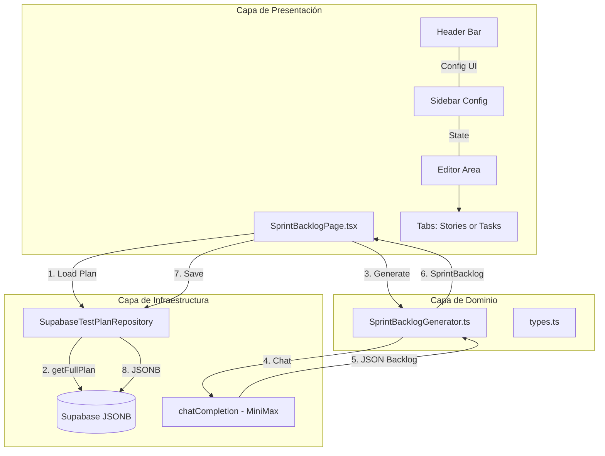
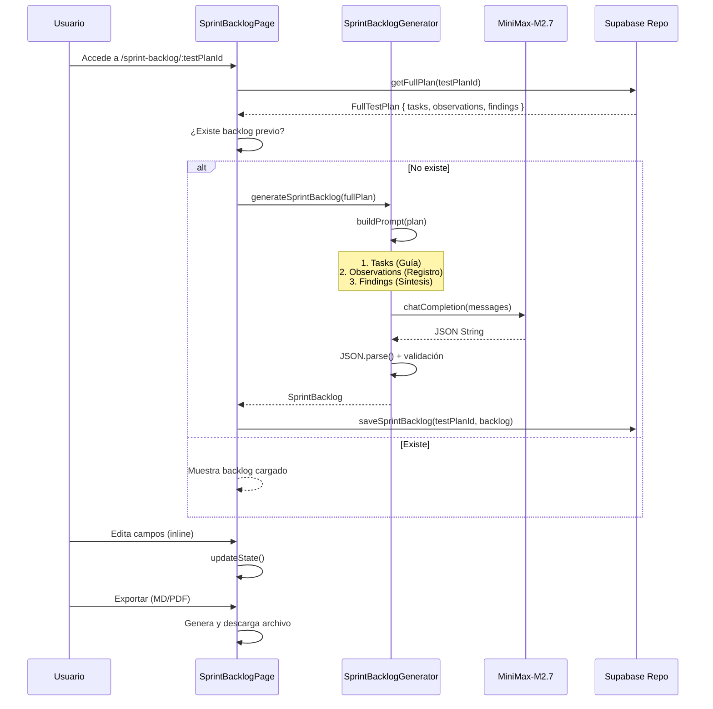
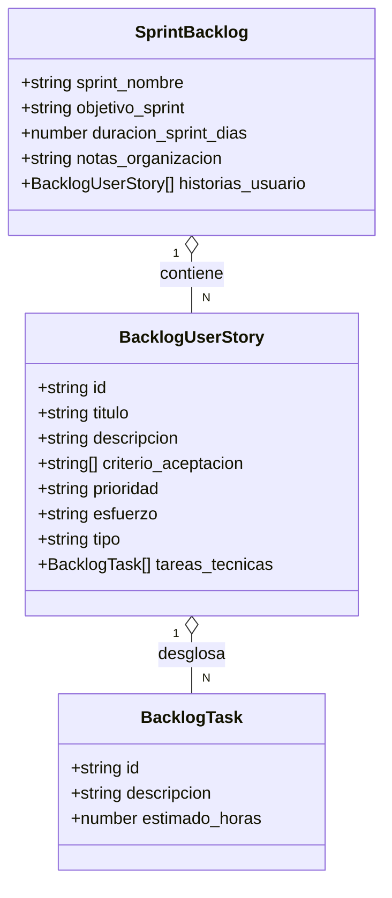
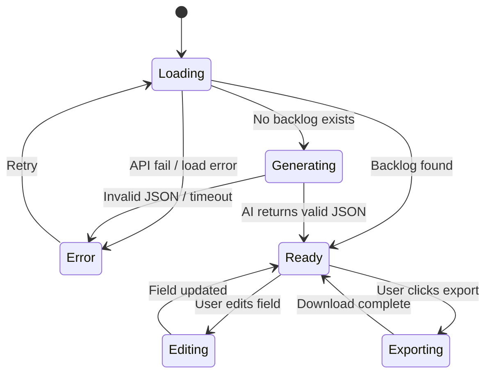
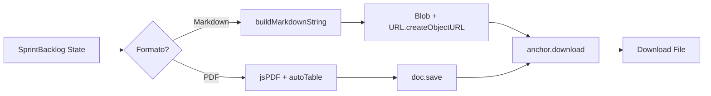
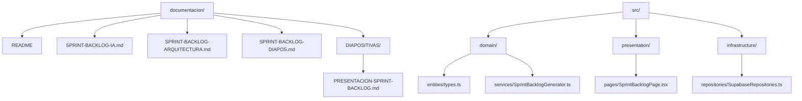
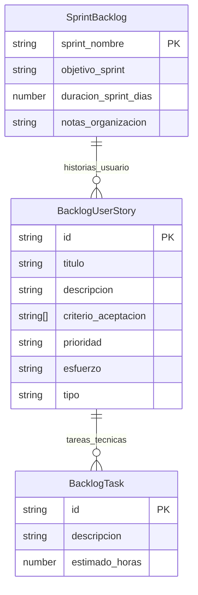
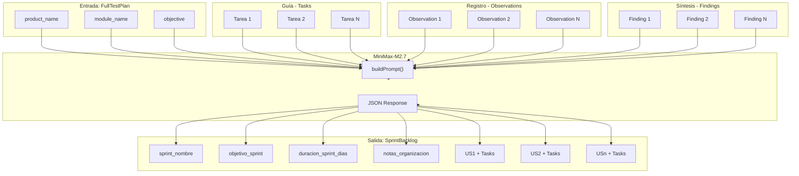
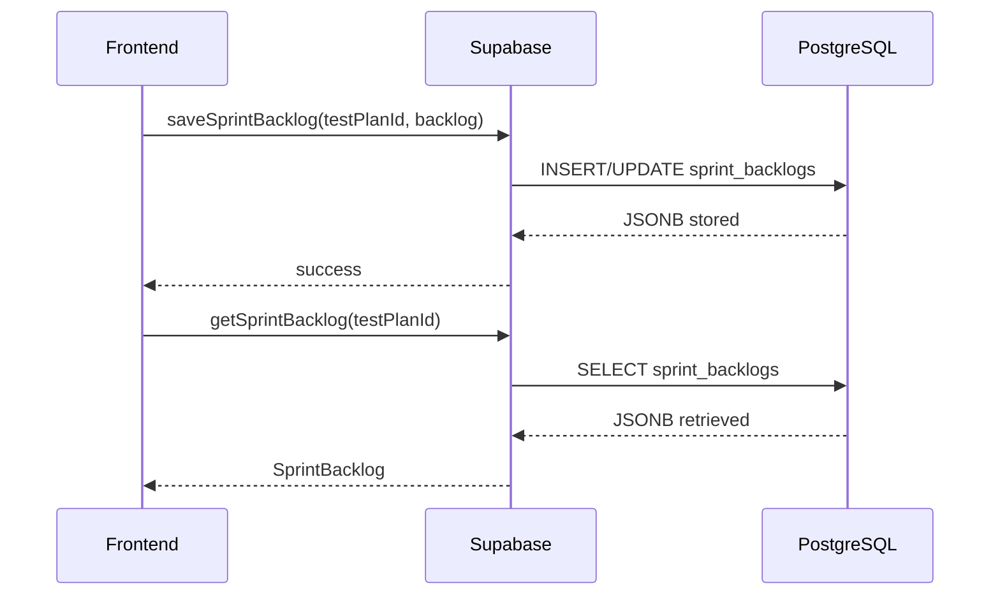

# Sprint Backlog AI - Arquitectura y Diagramas

> Documentación visual usando Mermaid para GitHub y herramientas compatibles

---

## 1. Arquitectura de Componentes

---

## 2. Flujo de Generación de Sprint Backlog

---

## 3. Modelo de Datos (Relación Jerárquica)

---

## 4. Estados de la UI

---

## 5. Flujo de Exportación

---

## 6. Estructura de Archivos

---

## 7. Esquema JSON - Campos Obligatorios

---

## 8. Diagrama de Flujo de Datos

---

## 9. Endpoints de Supabase (Implicados)

---

## 10. Parámetros de Configuración IA

| Parámetro | Valor | Descripción |
|-----------|-------|-------------|
| `model` | `MiniMax-M2.7` | Modelo de chat |
| `temperature` | `0.3` | Baja variabilidad |
| `max_tokens` | `8192` | Contexto amplio |
| `system_role` | PO Experto Scrum | Define comportamiento |

---

*Diagramas generados con Mermaid para compatibilidad con GitHub Markdown*